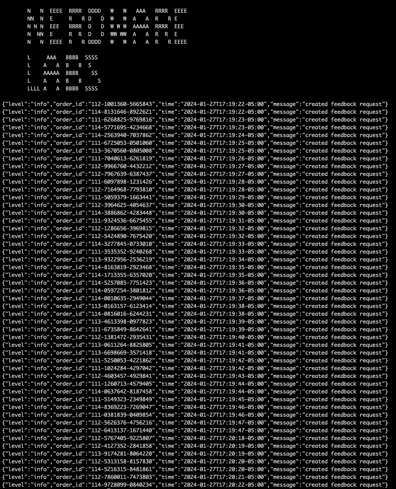
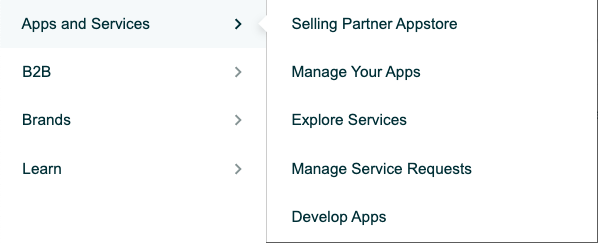
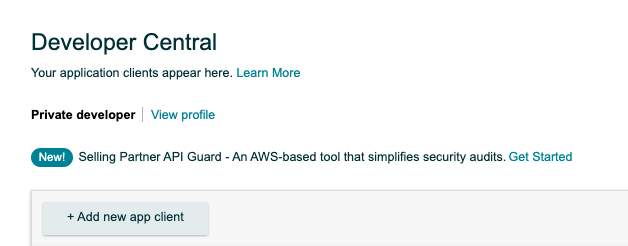
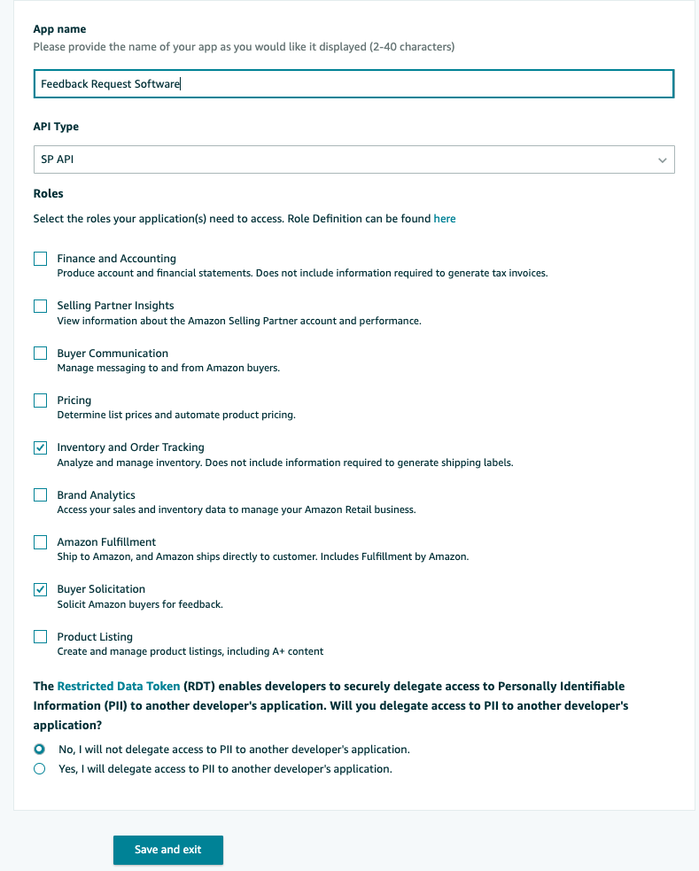
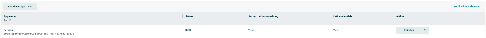
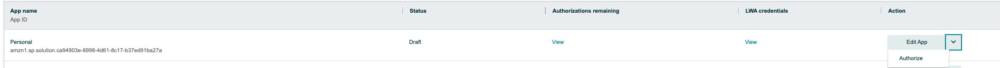
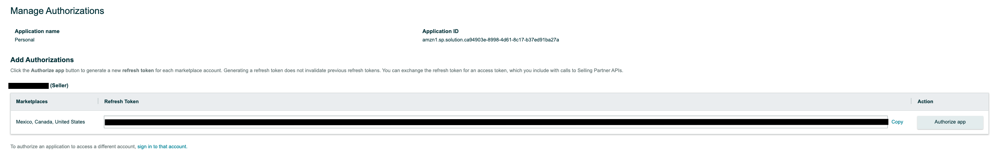

# Feedback Request Automation
Request seller and product feedback from your orders automatically with this software.

You'll have to rull this software whenever you want to request reviews. You could set this up as a cron task on a hosted server or locally with a mac scheduler or something similar.

If you have any questions about this, you can contact me using the following methods:

**Discord**: @teddycodes (preferred)

Instagram: @teddy_codes

If you have any issues with the software, please let me know in a github issue (or dm). This repo is still being actively maintained.

# Example output


# How to run the binary:
Depending on your operating system, you'll have to run it a few different ways. The config.yml file has to be in the same directory as you're launching the binary.

## Windows
```sh
.\feedback.exe
```

## Mac
```sh
./feedback
```

# Getting Started
To get started using this you'll need to create a private SP-API app.

-> Apps and Services -> Develop Apps



-> Add new app client



-> Fill out the form with the following options:


-> Save and exit

-> Click "View" under LWA credentials


-> Rename config.example.yml to config.yml
-> Copy your client identifer and client secret into the config.yml file

-> Go back to the app table view


-> Go to the dropdown on the right of edit and click authorize


-> Click Authorize and copy to Refresh Token to the config.yml file.
